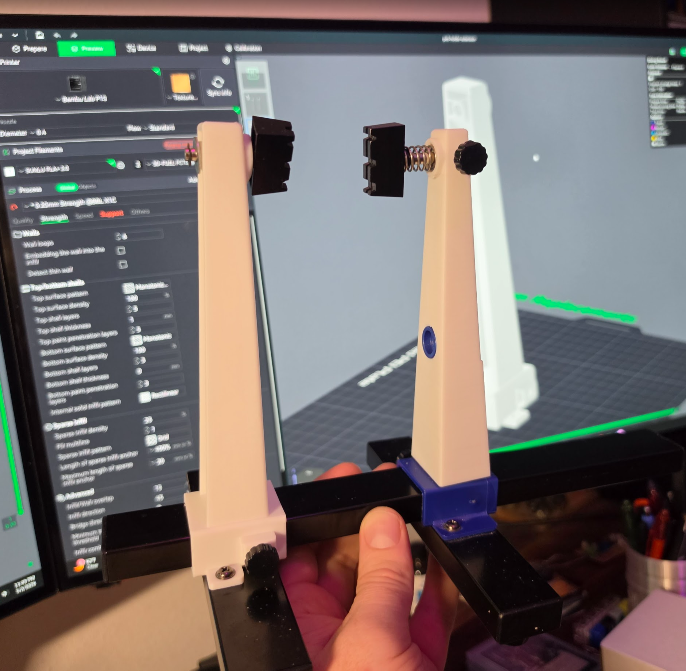
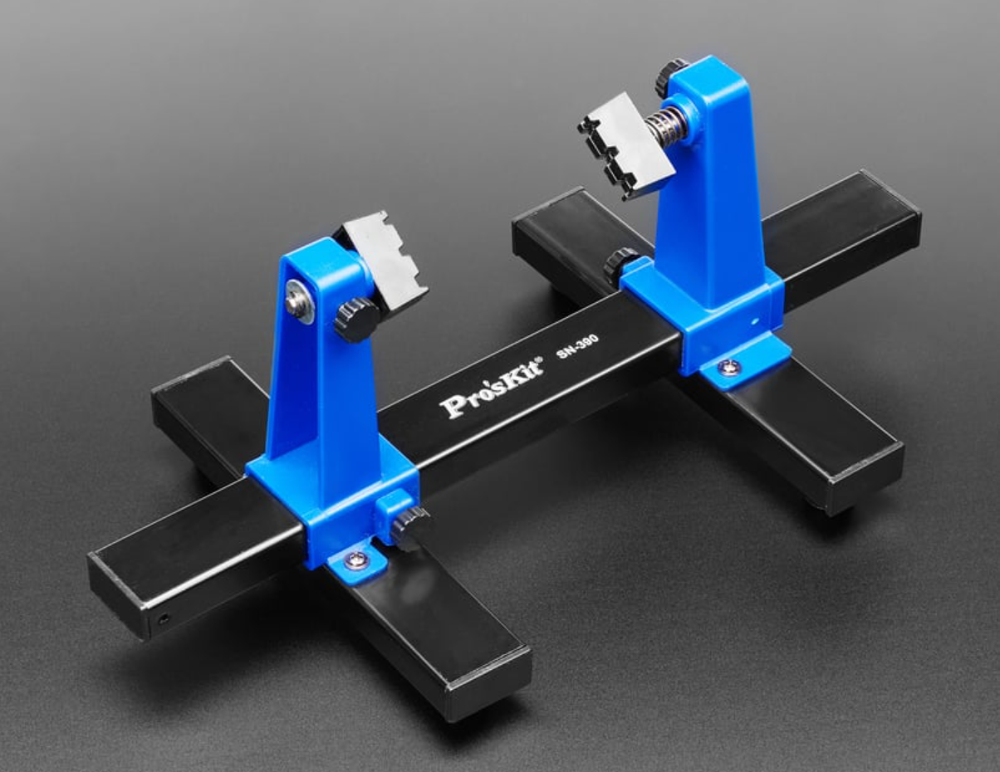

# PCB Holder Extension

Two OpenSCAD-designed solutions for mounting wider/longer PCBs that exceed a standard PCB holder's capacity: a cap-on extension and a full arm replacement.

## Target Holders

This extension is designed for standard PCB holders with ~200×140mm max capacity:

| Brand | Model | Max PCB Size | Link |
|-------|-------|--------------|------|
| Noah | NH-11E | 200×140mm | [Amazon](https://www.amazon.com/Noah-Adjustable-Soldering-Desoldering-Rotation/dp/B0CY4DRHWK/) |
| Pro's Kit | SN-390 | 200×140mm | [Adafruit](https://www.adafruit.com/product/3791) |

### Pro's Kit SN-390 Specifications
- **Material**: ABS arms + metal base
- **Dimensions**: 300 × 165 × 125mm
- **Weight**: 450g
- **Features**: 4 slots for varying PCB thicknesses, non-slip rubber pads, 360° rotation

## Problem

Standard PCB holders (like the Noah model above) allow:
- Horizontal expansion left and right
- Rotation of PCBs in spring-loaded braces

However, they have size limitations. When PCBs exceed these limits, rotation becomes impossible because the PCB hits the holder's frame.

## Solution

Two approaches are available; choose one:

- **`pcb-holder-extension:`** Caps onto the top of each existing vertical arm, adding height above the original. One piece per side.
- **`pcb-holder-long-arm:`** A full replacement for the entire vertical arm, providing a taller profile without modifying the base.

Either way, the hardware from the original holder is reused.

### Mounting Method: Extension

Mounts on **both sides** of the holder (one piece per arm):

1. Slide the extension cap over the top of the existing vertical arm.
2. Slide the PCB grip bolt (reused from the original holder) through the bolt hole from inside to outside.
3. Place the washer (from the original holder) onto the bolt on the outside.
4. Press the retainer clip (from the original holder) onto the washer to lock it in place. The washer keeps the PCB grip bolt from sliding out, while the grip on the inner side prevents it from going through.

### Mounting Method: Long Arm (Replacement)

Slides onto the base rail from **either side** as a drop-in replacement:

1. Slide the original vertical arm off the base rail.
2. Remove the hand screw.
3. Slide the replacement arm onto the rail from either side.
4. Reuse the original hand screw and hardware to secure.

**Locking the arm in place:** The long arm uses a **rail-lock pin** to lock its position on the rail. This pin presses against the rail from the side, securing the arm without relying on the hand [...]

> **Rail-lock pin:** A replacement pin ([`rail-lock-pin.scad`](src/rail-lock-pin.scad) / `rail-lock-pin.stl`) is included in this repo in case the original pin is lost or worn out.

### Measured Arm Dimensions

| View | Bottom | Top |
|------|--------|-----|
| Side (force direction) | 30mm | 20mm |
| Front (facing PCB) | 24mm | 16mm |

- **Retainer bolt hole**: 4mm diameter, protrudes ~4mm toward center

## Repository Layout

- [`src/pcb-holder-extension.scad`](src/pcb-holder-extension.scad)  
  Parametric OpenSCAD source for the cap-on extension. Modify the variables at the top of the file to match your specific holder.

- [`src/pcb-holder-long-arm.scad`](src/pcb-holder-long-arm.scad)  
  Parametric OpenSCAD source for the full arm replacement. Modify the variables at the top of the file to match your specific holder and rail.

- [`src/rail-lock-pin.scad`](src/rail-lock-pin.scad)  
  Replacement rail-lock pin for the long arm. Print this if the original pin is lost or worn; it's the pin that presses against the base rail to lock the arm's position.

- `publication/`  
  Platform-specific release folders.
  - In derived repos, create one subfolder per destination platform.
  - Examples: `publication/MakerWorld/`, `publication/Printables/`.

## Customization Parameters

### Shared (both files)

Set these to match your physical PCB holder hardware. Both [`src/pcb-holder-extension.scad`](src/pcb-holder-extension.scad) and [`src/pcb-holder-long-arm.scad`](src/pcb-holder-long-arm.scad) have [...]

| Parameter | Default | Description |
|-----------|---------|-------------|
| `retainer_bolt_hole_d` | 5 mm | Diameter of the retainer bolt hole |
| `retainer_boss_od` | 16.5 mm | OD of the boss around the bolt hole on the arm's inner face |
| `retainer_boss_protrude` | 3.5 mm | How far the boss protrudes toward the PCB |
| `hand_screw_thread_d` | 3.85–4 mm | Hand-screw thread OD (M4-ish; 3.85 in extension, 4 in long arm) |
| `hand_screw_nut_af` | 7 mm | Hex nut across-flats (M4) |
| `wall_thickness` | 3 mm | Wall thickness throughout |
| `wall_x_trim` | 3.5 mm | Body width reduction on the open (+X) side |
| `top_bolt_offset_from_top` | 12 mm | Top bolt hole center, measured down from the top of the piece |
| `bolt_clearance` | 0.35 mm | Oversize on bolt through-holes |

### Extension-specific ([`pcb-holder-extension.scad`](src/pcb-holder-extension.scad))

Arm dimensions are measured from your original holder arm. Cap geometry controls the added height.

| Parameter | Default | Description |
|-----------|---------|-------------|
| `arm_x_bottom` / `arm_x_top` | 23.5 / 16 mm | Arm width in X at bottom / top (front view, retainer-bolt axis) |
| `arm_y_bottom` / `arm_y_top` | 30 / 20 mm | Arm depth in Y at bottom / top (side view, hand-screw axis) |
| `arm_height` | 80 mm | Total height of the original vertical arm |
| `retainer_bolt_z_from_bottom` | 65 mm | Bolt-hole center, measured from the arm bottom |
| `extension_height` | 80 mm | Extra height added above the original arm top |
| `sleeve_depth` | 84 mm | How far the sleeve covers the arm from the top |
| `surface_tolerance` | 0.0 mm | Per-side clearance between sleeve cavity and arm |
| `boss_recess_clearance` | −0.45 mm | Clearance on the boss recess (negative = interference; tune for snug fit) |

### Long arm-specific ([`pcb-holder-long-arm.scad`](src/pcb-holder-long-arm.scad))

Body cross-section and rail parameters for the replacement arm.

| Parameter | Default | Description |
|-----------|---------|-------------|
| `body_x_bottom` / `body_x_top` | 29.9 / 18.5 mm | Outer body X width at bottom / top |
| `body_y_bottom` / `body_y_top` | 31.3 / 20 mm | Outer body Y depth at bottom / top |
| `lower_height` | 84 mm | Body length below the bracket attachment point |
| `upper_height` | 80 mm | Body length above the bracket attachment point |
| `rail_y` / `rail_z` | 30 / 15 mm | Rail cross-section dimensions |
| `rail_clearance` | 0.2 mm | Per-side slip-fit clearance around the rail |
| `rail_base_x` | 40 mm | Rail base grip length along the rail |

## Design Specifications

- **Material**: PLA+, PCTG, PETG, ABS, ASA, or similar (tested with PLA+ and PCTG. Both showed no signs of weakness and either should be plenty strong for most users)
- **Layer height**: 0.2 mm
- **Infill**: 20-25%
- **Supports**: May be required depending on orientation
- **Nozzle**: 0.4 mm (minimum wall: 0.8-1.2 mm)

## Key Features

- **Extension:** caps onto existing arms on both sides; no disassembly required
- **Long arm:** full arm replacement; slides onto the base rail from either side
- Both maintain compatibility with the spring-loaded brace mechanism
- Parametric OpenSCAD design; adjust dimensions to match your holder
- FDM-optimized with proper tolerances

## Suggested Workflow

1. Customize dimensions in OpenSCAD for your specific holder.
2. Export to STL for your slicer.
3. Print with appropriate settings for your material.
4. Mount: slide extension caps onto both arms, or swap in the long arm replacement on each side.
5. Test fit with your largest PCB before rotation.
